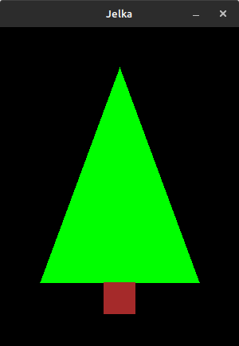
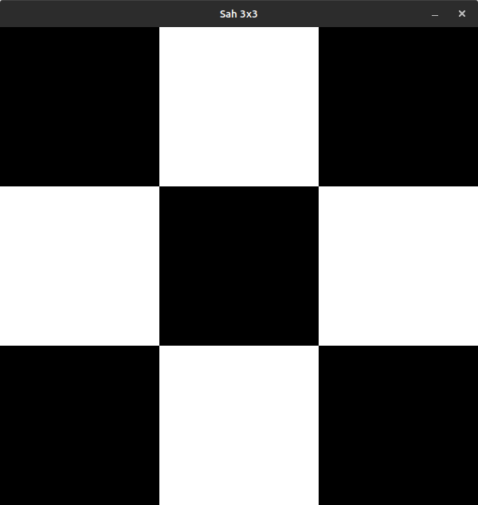
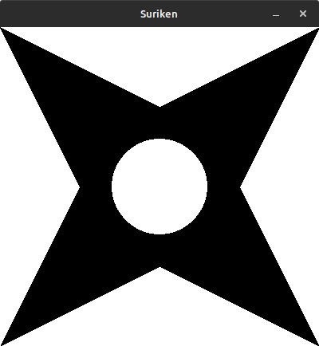

## Zadaci sa casa (8. Okt) - crtanje raznih slika

[↩️ Vratiti se na glavnu stranu](../README.md)

### Jelka



```python
import pygame
import pygamebg

prozor = pygamebg.open_window(300, 400, "Jelka")

zelena = pygame.Color('green')
braon = pygame.Color('brown')
pygame.draw.polygon(prozor, zelena, [ (150,50), (50,320), (250,320) ])
pygame.draw.rect(prozor, braon, (150-20,320,40,40))

pygamebg.wait_loop()
```

### Sahovska tabla 3x3



```python
import pygame
import pygamebg

prozor = pygamebg.open_window(600, 600, "Sah 3x3")

bela = pygame.Color('white')
pygame.draw.rect(prozor, bela, (200,0,200,200))
pygame.draw.rect(prozor, bela, (0,200,200,200))
pygame.draw.rect(prozor, bela, (200,400,200,200))
pygame.draw.rect(prozor, bela, (400,200,200,200))

pygamebg.wait_loop()
```

### Suriken



```python
import pygame
import pygamebg

prozor = pygamebg.open_window(400, 400, "Suriken")

prozor.fill(pygame.Color('white'))

temena = [
    (0,0),     # gornje levo teme
    (200,100),  # gornje udubljenje
    (400,0),   # gornje desno temo
    (300,200), # desno udubljenje
    (400,400), # donje desno teme
    (200,300), # donje udubljenje
    (0,400),   # donje levo teme
    (100,200)   # levo udubljenje
]

pygame.draw.polygon(prozor, pygame.Color('black'), temena)
pygame.draw.circle(prozor, pygame.Color('white'), (200,200), 60)

pygamebg.wait_loop()
```