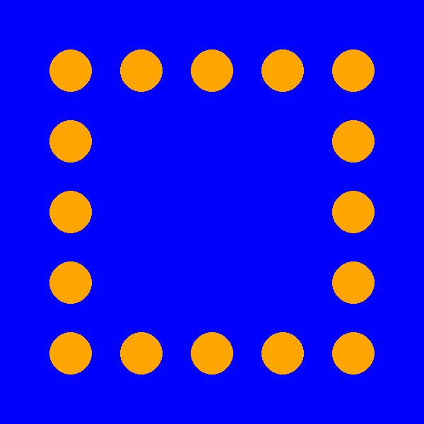
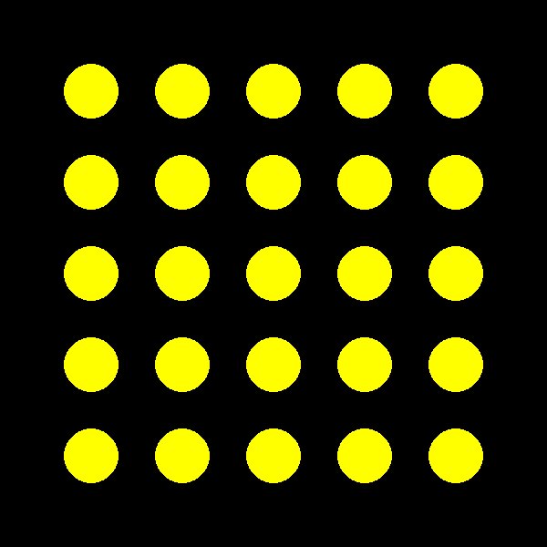
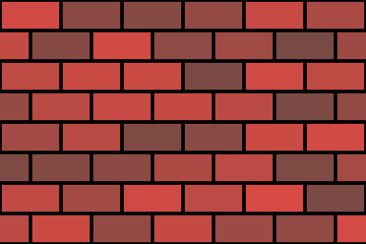

## Zadaci sa casa (29. Okt) - petlje u Python-u, nastavak

[↩️ Vratiti se na glavnu stranu](../README.md)

### Merdevine II


```python
import pygame
import pygamebg

prozor = pygamebg.open_window(600, 600, "Merdevine II")

bela = pygame.Color('white')

x, y = 150, 500  # pocetak merdevina (donja leva tacka)
sirina = 100     # sirina merdevina
n = 10           # broj stepenika
dx, dy = 10, 40  # nagib merdevina, promena x i y

pygame.draw.line(prozor, bela, [x, y], [x + n*dx, y - n*dy], 10)                    # prednja leva strana merdevina
pygame.draw.line(prozor, bela, [x + sirina, y], [x + n*dx + sirina, y - n*dy], 10)  # prednja desna strana (leva pomerena za sirinu udesno)

for i in range(n):
    x += dx
    y -= dy
    pygame.draw.line(prozor, bela, [x, y], [x + sirina, y], 5)

pygame.draw.line(prozor, bela, [x, y], [x + n*dx, y + n*dy], 10)                    # zadnja leva strana merdevina
pygame.draw.line(prozor, bela, [x + sirina, y], [x + n*dx + sirina, y + n*dy], 10)  # zadnja desna strana

pygamebg.wait_loop()
```

### Kvadrat krugova I


```python
import pygame
from pygame import Color
import pygamebg

prozor = pygamebg.open_window(600, 600, "Merdevine II")

prozor.fill(Color('blue'))

for x in range(100, 501, 100):
    pygame.draw.circle(prozor, Color('orange'), [x, 100], 30)

for x in range(100, 501, 100):
    pygame.draw.circle(prozor, Color('orange'), [x, 500], 30)

for y in range(100, 501, 100):
    pygame.draw.circle(prozor, Color('orange'), [100, y], 30)

for y in range(100, 501, 100):
    pygame.draw.circle(prozor, Color('orange'), [500, y], 30)

pygamebg.wait_loop()
```

### Kvadrat krugova II


```python
import pygame
from pygame import Color
import pygamebg

prozor = pygamebg.open_window(600, 600, "Merdevine II")

prozor.fill(Color('black'))

for x in range(100, 501, 100):
    for y in range(100, 501, 100):
        pygame.draw.circle(prozor, Color('yellow'), [x, y], 30)

pygamebg.wait_loop()
```

### Cigle


```python
import pygame
from pygame import Color
import pygamebg

from random import randint

prozor = pygamebg.open_window(600, 400, "Cigle")

prozor.fill(Color('black'))

for y in range(0, 400, 50):
    pomeraj = y % 100
    for x in range(-pomeraj, 600, 100):
        boja_cigle = Color(170 + randint(-50, 50), 74, 68) # R komponenta je random broj izmedju 120 i 220
        pygame.draw.rect(prozor, boja_cigle, [x, y, 100, 50])
        pygame.draw.rect(prozor, Color('black'), [x, y, 100, 50], 3)

pygamebg.wait_loop()
```
