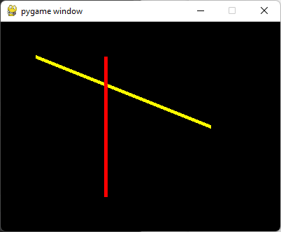
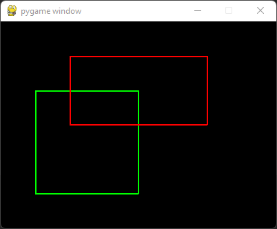
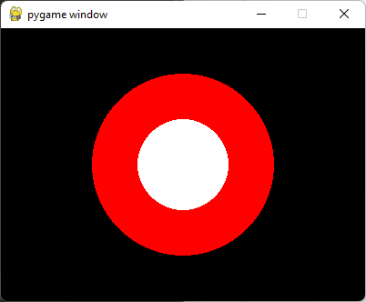

# Uvod u Pygame: koordinate, boje, crtanje osnovnih oblika

[↩️ Vratiti se na glavnu stranu](../README.md)

## Koordinatni sistem
Koordinate su veoma bitan pojam u PyGame-u jer se pozicija svakog oblika koji crtamo na ekranu zadaje bas uz pomoc njegovih koordinata.

Koordinatni sistem kod racunara se razlikuje od onog koji smo ucili i na koji smo navikli u matematici; svaka tacka se i dalje zadaje uz pomoc dve koordinate **x** i **y**. **x** koordinatu koristimo kao i pre, a **y** koordinata je "prevrnuta", to jest sto je tacka niza na ekranu to je vrednost **y** koordinate veca:

>   
> Koordinatni sitem u racunarstvu  
> *Izvor: [petlja.org](https://petlja.org)*

Drugim recima, prva koordinata odredjuje koliko je tacka udaljena od leve ivice prozora, a druga koliko je tacka udaljena od gornje ivice prozora.

## Boje
Prosli cas smo pricali o RGB nacinu zapisivanja boja. Boje je moguce zadavati na taj nacin, ali u PyGame postoji i predefinisan skup osnovnih boja. Medju njima su boje poput crvene, zelene, crne, zute, itd. Koristimo ih tako sto napisemo `pygame.Color('naziv boje na engleskom')`. Na primer, `pygame.Color('yellow')` je zuta boja, a `pygame.Color('red')` je crvena.

Pokretanjem koda ...
```python
import pygame
import pygamebg

prozor = pygamebg.open_window(400, 300, "pygame window")  # stvaramo prozor dimenzija 400x300

prozor.fill( pygame.Color('yellow') ) # popunjavamo (fill) ceo prozor zurom bojom

pygamebg.wait_loop() # cekamo dok korisnik ne zatvori prozor
```
... dobijamo prozor dimenzija 400x300 sa zutom pozadinom:
>  

> 
> Fun fact: tako 'gotovih' boja ima 657 (vecinom su razlicite nijanse istih osnovnih boja), U tih 657 boja ukljucene su boja zlata (`gold`) i boja psenice (`wheat`).
> 
> Spisak naziva mozete videti u [Pygame dokumnetaciji](https://www.pygame.org/docs/ref/color_list.html).


### RGB boje
Pored predefinisanih, mozete koristiti i boje zadatake u RGB formatu
koji opisuje boju kao kombinaciju crvene (Red), zelene (Green) i plave
(Blue). Na primer, crvena boja `pygame.Color('red')` je isto sto i 
`(255, 0, 0)` u RBG fromatu, pa mozemo je zapisati i na ovaj nacin.

RGB vrednosti za boje mozete odrediti uz pomoc [ove Guglove alatke](https://g.co/kgs/ZKe38V) (Color Picker).

## Crtanje osnovnih oblika
Sve funkcije za crtanje u biblioteci PyGame pocinju sa `pygame.draw`.
Naucicemo sada kako se crtaju duzi, pravougaonici i krugovi.

### Crtanje duzi
Duz se crta pozivom funkcije `pygame.draw.line`. Ova funkcija zahteva 
nekoliko parametara (**redosled je bitan**):
1. povrsinu na kojoj crtamo duz (u nasem slucaju to je prozor)
2. boja duzi
3. koordinate prvog temena u obliku (x1, y1) 
4. koordinate drugog temena u obliku (x2, y2)
5. debljina duzi u pikselima

Na primer:
```python
pygame.draw.line(prozor, pygame.Color('yellow'), (50, 50), (300, 150), 5)
pygame.draw.line(prozor, pygame.Color('red'), (150, 50), (150, 250), 5)
```

> 
 
### Crtanje kvadrata i pravougaonika
Funkcija koja se koristi za crtanje kvadrata i pravougaonika je
`pygame.draw.rect` (*rect* je skraceno za *rectangle* odnosno pravougaonik).
Parametri ove funkcije redom su:
1. prozor
2. boja
3. cetvorka brojeva (x, y, sirina, visina). **x** i **y** su koordinate gornjeg
levog temena pravougaonika, a **sirina** i **visina** su njegove dimenzije.

Na primer:
```python
pygame.draw.rect(prozor, pygame.Color('green'), (50, 100, 150, 150))  # zeleni kvadrat dimenzija 150x150
pygame.draw.rect(prozor, pygame.Color('red'), (100, 50, 200, 100))  # crveni pravougaonik dimenzija 200x100
```
>   

Mozemo dodati i cetvrti parametar `width` koji predstavlja debljinu konture u pikselima.
U ovom slucaju oblik koji nacrtamo nece biti popunjen, to jest nacrtace se samo njegova
kontura:
```python
pygame.draw.rect(prozor, pygame.Color('green'), (50, 100, 150, 150), 2)  # zeleni kvadrat dimenzija 150x150
pygame.draw.rect(prozor, pygame.Color('red'), (100, 50, 200, 100), 2)  # crveni pravougaonik dimenzija 200x100
```
> 

Isto vazi i za sve sledece oblike.

### Crtanje krugova
Funkcija koja se koristi za crtanje krugova je `pygame.draw.circle`. Parametri ove funkcije redom su:
1. prozor
2. boja
3. koordinate centra kruga
4. poluprecnik kruga

Na primer, sledeci kod iscrtava metu:
```python
pygame.draw.circle(prozor, pygame.Color('red'), (200, 150), 100) # veliki crveni krug iza
pygame.draw.circle(prozor, pygame.Color('white'), (200, 150), 50) # mali beli krug ispred
```

> 

[↩️ Vratiti se na glavnu stranu](../README.md)
