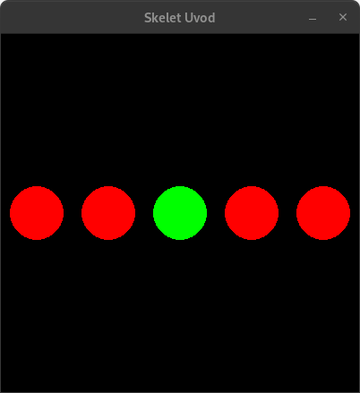

## Zadaci sa casa (22. Okt) - petlje u Python-u: `for` i `while`

[↩️ Vratiti se na glavnu stranu](../README.md)

### Primer: petlja i uslov



```python
import pygame
import pygamebg

prozor = pygamebg.open_window(400, 400, "Skelet Uvod")

boja = pygame.Color('red')
crvena = boja
zelena = pygame.Color('green')

#x = 40
#while x <= 360:
#    pygame.draw.circle(prozor, boja, [x, 200], 30)
#    x += 80

#for x in [40,120,200,280,360]:
#    pygame.draw.circle(prozor, boja, [x, 200], 30)

#for x in range(40, 361, 80):
#    pygame.draw.circle(prozor, boja, [x, 200], 30)

for x in range(40, 361, 80):
    # icrtavamo krugove na pozicijama 40, 120, 200, 280, 360;
    # a samo krug u centru (x=200) je zelene boje, 
    # dok su ostali crveni
    if x == 200:
        pygame.draw.circle(prozor, zelena, [x, 200], 30)
    else:
        pygame.draw.circle(prozor, crvena, [x, 200], 30)

pygamebg.wait_loop()


```

### Meta


### Merdevine I


```python
import pygame
import pygamebg

prozor = pygamebg.open_window(600, 600, "Merdevine I")

bela = pygame.Color('white')

for y in range(120, 481, 40):
    pygame.draw.line(prozor, bela, [240, y], [360, y], 10)
    
pygame.draw.line(prozor, bela, [240, 100], [240, 500], 10)
pygame.draw.line(prozor, bela, [360, 100], [360, 500], 10)

pygamebg.wait_loop()
```
